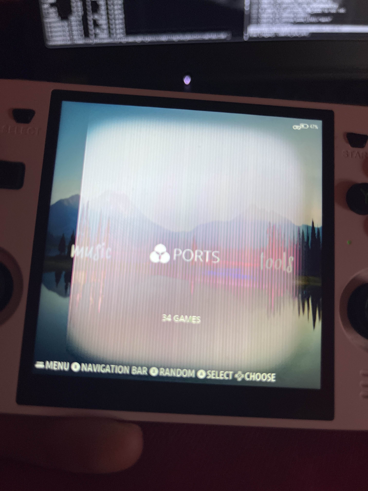

This was an attempt to compile a full desktop environment for a handheld
single-board computer emulator. It failed spectacularly. I'm glad that I had the
opportunity to procure a relatively expensive handheld for so cheap to
experiment with.

Enjoy

I thought I got it. I did not. The driver for the panel was entirely wrong. I later learned that I, in fact, had no idea what I was doing

This ghosting lasted for an hour or so after the OS had been reflashed to something that actually works

